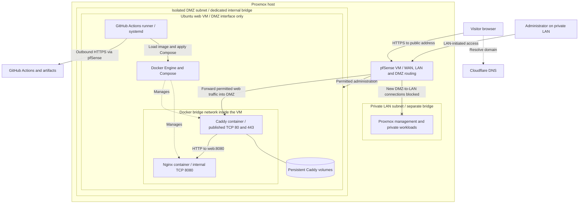
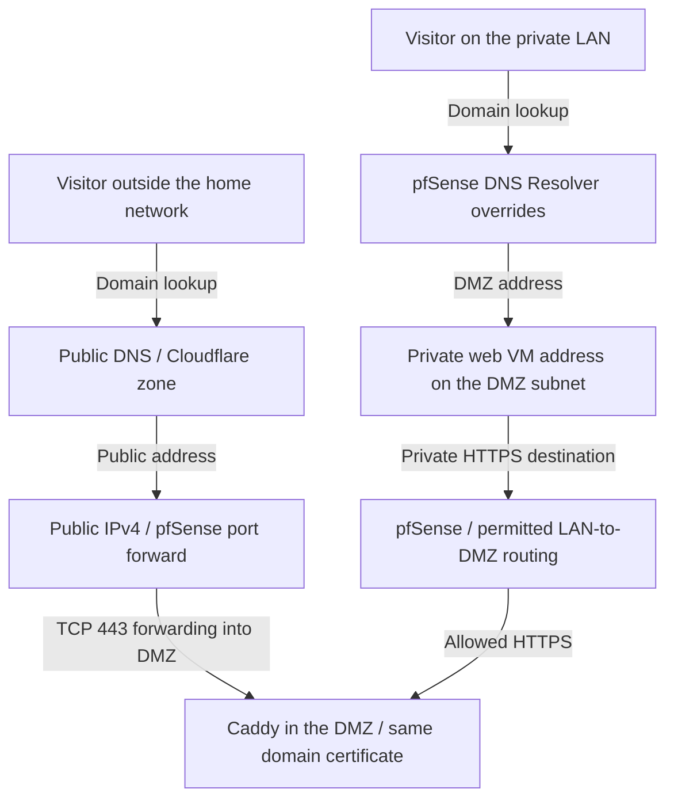
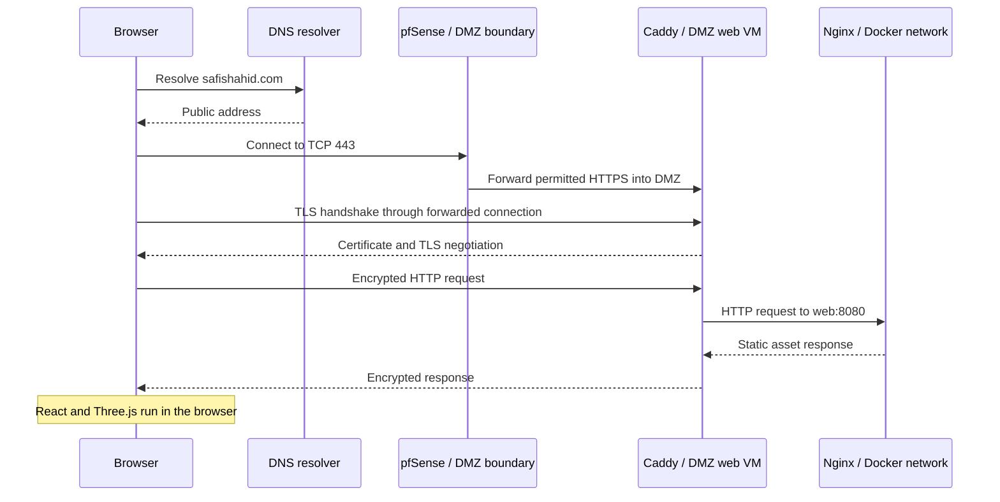
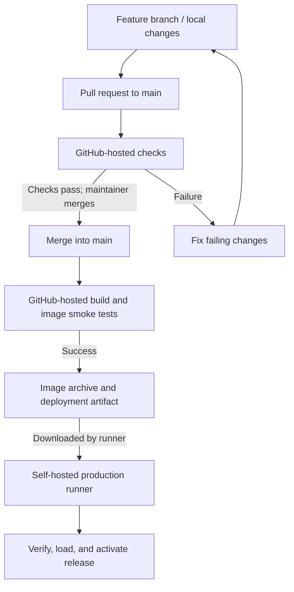
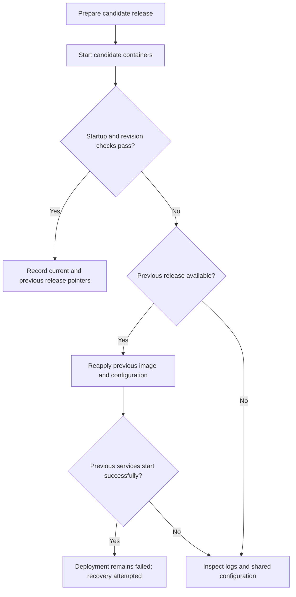

# Safi Shahid — Portfolio Architecture

**A React and Three.js portfolio running in Docker, delivered through CI/CD, and hosted in an isolated DMZ subnet on Proxmox.**

[Visit the portfolio](https://safishahid.com) · [LinkedIn](https://www.linkedin.com/in/safi-shahid/) · [GitHub profile](https://github.com/SafiShahid34)

I built and operate this site using GitHub Actions, Docker Compose, Ubuntu Server, Proxmox, pfSense, DNS, and automated HTTPS. The design connects application delivery with the network and runtime controls needed to operate a public service.

Three decisions shape the architecture:

- **Isolate public hosting.** The web VM has a dedicated DMZ subnet and virtual bridge, with pfSense controlling routed access to the private LAN.
- **Define the runtime in code.** Docker packages the application, while Compose defines the services, network, storage, and runtime controls.
- **Deploy the tested image.** GitHub builds and validates each application image; the production runner verifies and activates it, checks the release revision, and can restore a retained release.

This repository explains the architecture and engineering decisions. Application source, production configuration, and administrative procedures are maintained separately in a private repository. Internal addresses, credentials, and operational commands are excluded from this public overview.

## Contents

- [Project at a glance](#project-at-a-glance)
- [Architecture](#architecture)
- [DMZ isolation and network security](#dmz-isolation-and-network-security)
- [Docker and container runtime](#docker-and-container-runtime)
- [Application and rendering](#application-and-rendering)
- [Compute and resource usage](#compute-and-resource-usage)
- [Domain and DNS](#domain-and-dns)
- [HTTPS and request flow](#https-and-request-flow)
- [CI/CD and release delivery](#cicd-and-release-delivery)
- [Health checks and recovery](#health-checks-and-recovery)
- [Runner trust and security boundaries](#runner-trust-and-security-boundaries)
- [Monitoring and observability — planned](#monitoring-and-observability--planned)
- [Architectural decisions](#architectural-decisions)
- [Source organization](#source-organization)
- [Technical references](#technical-references)

## Project at a glance

| Area | Implementation |
| --- | --- |
| Application | React, TypeScript, Vite, Three.js, React Three Fiber |
| Presentation | Tailwind CSS, project CSS, GSAP, Drei, selective postprocessing |
| Hosting | Ubuntu Server 24.04 LTS on Proxmox VE |
| VM resources | **1 vCPU and 2 GB RAM** |
| Container runtime | Docker Engine and Docker Compose; separate Caddy and Nginx services |
| Static web server | Nginx |
| Reverse proxy and HTTPS | Caddy with automated certificate management |
| CI | GitHub-hosted build and validation jobs |
| Deployment | Self-hosted GitHub Actions runner managed by systemd |
| Domain and DNS | Cloudflare, using DNS-only records |
| Network isolation | Separate private LAN and DMZ subnets on distinct Proxmox bridges; web VM attached only to the DMZ |
| Security controls | pfSense inter-subnet policy and perimeter filtering, UFW host policy, and container restrictions |
| Monitoring — planned | Prometheus metrics, Grafana dashboards, exporters, and Alertmanager |
| Release management | Commit-tagged images, verified artifacts, retained releases, and scripted rollback |

The deployed architecture is described below; future monitoring work is explicitly marked as planned. Resource figures are snapshots, not load-test results.

## Architecture

### Production topology

**The web VM is on a different subnet from the private LAN.** Its dedicated Proxmox bridge connects it to the DMZ interface of the pfSense VM. The former LAN attachment has been removed, so the web VM has no direct path onto the LAN bridge.

The subnet boxes show network membership. pfSense controls traffic between those networks, including permitted administration from the LAN and blocked new connections from the DMZ toward private LAN hosts. The outbound GitHub connection also passes through pfSense.

Inside the web VM, a second network layer connects the Docker containers. This Docker bridge handles Caddy-to-Nginx traffic; the DMZ boundary controls the VM's access to the wider network.

The architecture has two main paths:

- **Website traffic:** the browser resolves the domain, connects through pfSense, and receives the site through Caddy and Nginx.
- **Deployment traffic:** the runner connects outward to GitHub, downloads a build artifact, and uses Docker to activate the release.

Ubuntu runs Docker Engine and the deployment runner as host services. Docker runs Caddy and Nginx as separate containers sharing the Ubuntu kernel, with Compose defining their runtime configuration. The runner controls releases; visitor requests flow through the two containers.

### Where work happens

| Location | Responsibility |
| --- | --- |
| Development laptop | Content and code changes, local previews, Git branches |
| GitHub-hosted runner | Dependency installation, validation, application and image builds, smoke tests |
| Production VM | Artifact verification, image loading, deployment, and release checks |
| Caddy container | HTTPS, redirects, reverse proxying, and compression |
| Nginx container | Static files and application health/revision responses |
| Visitor's browser | React execution, WebGL rendering, and interaction |

Building on GitHub keeps compilation off the small production VM. Three.js rendering uses the visitor's graphics hardware; the server delivers the assets.

## DMZ isolation and network security

### Dedicated DMZ subnet

I moved the website from the private LAN to a **dedicated DMZ: a separate subnet for the public workload**. The goal is to keep a compromised web VM from initiating unrestricted connections to private devices or management services.

The migration established a separate internal Proxmox bridge, connected it to a dedicated pfSense interface, and moved the web VM's network attachment and default route onto that DMZ. Public website forwarding now targets the VM in the DMZ. The old LAN NIC was removed after the new path was brought online.

The bridge has no physical network adapter attached. pfSense provides its routed path to other networks, so the DMZ can operate on the same Proxmox host without being bridged into the private LAN.

### How the boundaries work

| Layer | Design decision | Purpose |
| --- | --- | --- |
| Virtual machine | Dedicated Ubuntu VM for the web workload | Separate its operating system and allocated resources from other host workloads |
| Proxmox network | Distinct LAN and DMZ bridges and subnets | Prevent the web VM from sharing the private LAN segment |
| Routed boundary | pfSense interfaces connect the zones under firewall policy | Control which new connections may cross between networks |
| Container network | Caddy and Nginx share a Docker bridge inside the web VM | Keep application service communication within the container stack |

A separate address range establishes a routing boundary; firewall policy enforces the access restrictions. Removing the old LAN attachment ensures that inter-network traffic cannot bypass pfSense through a second VM interface.

### Directional access policy

| Traffic path | Control and purpose |
| --- | --- |
| Internet → website | Public web traffic is forwarded to Caddy in the DMZ |
| LAN → DMZ | LAN-initiated website and administrative access remains available, with host policy restricting SSH administration |
| DMZ → private LAN hosts | New connections initiated from the DMZ are blocked by the inter-network policy |
| DMZ → Internet | Outbound web connectivity supports updates, certificate management, and communication with GitHub |
| DMZ → infrastructure services | Explicit allowances support required services such as DNS |
| Caddy → Nginx | Application traffic stays on the internal Docker network |

pfSense applies interface rules where connections enter the firewall. Its state tracking permits replies to allowed LAN-initiated sessions without granting the DMZ permission to start new LAN sessions. The LAN-blocking policy takes precedence over broader outbound web access. This makes administration possible while restricting lateral movement from the public workload. [pfSense rule methodology](https://docs.netgate.com/pfsense/en/latest/firewall/rule-methodology.html)

The resulting policy supports private administration of a public workload while restricting the workload's ability to initiate access back into the private LAN. Network isolation is enforced by the configured routing and firewall rules. Patching, access controls, and protection of the shared hypervisor remain part of the design. Public website forwards do not publish Proxmox or firewall administration.

### Host and container controls

UFW provides a default-deny inbound host policy and restricts SSH to the administration network. The runner initiates outbound connections to GitHub, so deployment does not require an inbound administrative connection from GitHub.

Docker manages its own forwarding rules, so container port publication is reviewed alongside pfSense policy. Caddy is the only web entry point published by the stack; Nginx stays behind it. This accounts for Docker traffic that may bypass ordinary UFW filtering. [Docker firewall behavior](https://docs.docker.com/engine/network/packet-filtering-firewalls/)

## Docker and container runtime

Docker is the packaging and execution layer for the production website. The runtime consists of **two containers: Caddy for HTTPS and reverse proxying, and Nginx for the compiled application**. Docker Compose defines how those services run together on the Ubuntu VM.

### Application image and release identity

GitHub builds an application image containing the compiled frontend, Nginx runtime, and release identifier. That image is tagged with the source commit, smoke-tested, and exported as a deployment artifact. The production runner verifies the archive and loads the same tested image into Docker.

The application is delivered by replacing a versioned container image. This keeps the deployed files tied to a known commit and gives rollback a defined image to restore. Caddy runs from its own image and keeps its certificate state in persistent storage.

### Runtime configuration as code

Compose captures the service configuration needed to activate a release. Production-specific settings are supplied separately from application source.

| Compose responsibility | Purpose in this deployment |
| --- | --- |
| Service definitions and images | Select the application revision and reverse-proxy service |
| Network and port publication | Connect Caddy and Nginx while exposing only the intended web entry point |
| Persistent volumes and configuration mounts | Preserve certificate state and supply runtime configuration |
| Startup dependencies and health checks | Coordinate startup and provide readiness signals to deployment checks |
| Resource limits, restart policies, and log rotation | Bound resource consumption and support routine operation |

This makes the runtime repeatable from a declared configuration on a single Docker host. The deployment script coordinates validation, activation, release verification, and recovery around it. [Docker Compose](https://docs.docker.com/compose/intro/features-uses/)

### Container networking and service separation

Caddy and Nginx communicate over the Compose bridge network inside the VM. Caddy reaches Nginx by its service name, so application routing does not depend on a manually assigned container address. Caddy publishes the web entry points; Nginx has no direct published host port. [Compose networking](https://docs.docker.com/compose/how-tos/networking/)

The Docker bridge and the DMZ subnet serve different scopes. Docker provides communication between the services inside Ubuntu; the Proxmox bridge and pfSense policy separate that Ubuntu VM from private LAN systems.

### Container controls and persistent state

The Nginx container runs as a non-root user with a read-only root filesystem, limited temporary writable storage, dropped Linux capabilities, and privilege escalation disabled. CPU, memory, and process limits constrain its resource use. It serves static assets without a Node.js application server or development server.

Caddy handles HTTPS, redirects, proxying, and compression. Persistent volumes retain its certificate and runtime state across container replacement, while its configuration is mounted read-only. Caddy also has resource and log limits; runtime restrictions are selected for each service's requirements. [Docker volumes](https://docs.docker.com/engine/storage/volumes/)

### Restarts, logs, and caching

Both services have restart policies and bounded Docker log rotation. A failed health check reports an unhealthy state; the deployment and recovery process determines the release response. An unhealthy result alone does not automatically restart a container.

Content-hashed assets use long-lived caching, while HTML and the resume require revalidation. Release-identification responses are not cached, allowing deployment checks to verify which application revision is being served.

## Application and rendering

The static React application includes the portfolio and a dedicated consulting page, with experience, projects, services, contact details, and a downloadable resume. Typed content files keep routine updates separate from the interface.

React and Three.js execute in the visitor's browser. On-demand scenes, viewport gating, reduced-motion support, and accessible HTML fallbacks keep the visual layer independent of the readable content. Nginx serves the compiled assets; the application has no backend or database.

## Compute and resource usage

The Ubuntu VM currently has **1 vCPU and 2 GB of RAM**. Application and image builds run on GitHub, keeping compilation off the production VM.

| Component | Allocation or limit | Earlier idle memory sample |
| --- | --- | --- |
| Ubuntu VM | 1 vCPU, 2 GB RAM | Host allocation; includes the OS, Docker, and runner |
| Caddy | 0.50 CPU, 256 MiB memory limit | Approximately 9.3 MiB |
| Nginx | 0.50 CPU, 256 MiB memory limit | Approximately 2.6 MiB |
| Runner service | Shares VM resources | Approximately 39.5 MiB |

The service samples were captured at different times and are historical observations, not a combined measurement of the current VM. The container sample showed negligible idle CPU use. Limits are ceilings, not reserved cores or preallocated memory.

The small static-serving footprint supports this allocation. Deployment activity, retained images, and future monitoring will be evaluated separately; these samples do not establish peak capacity or a visitor limit.

## Domain and DNS

Cloudflare provides domain registration and authoritative DNS. The apex domain points to the public connection, and the `www` record resolves to the same site.

The records use **DNS-only mode**. Cloudflare resolves the hostname; website traffic goes directly to the home connection and Caddy. Cloudflare's HTTP proxy, caching, and edge TLS services are not part of this path.

### Split DNS

Local clients resolve the domain to the VM's private DMZ address and reach it through pfSense routing. External visitors resolve the public address and reach it through the website port forwards. Both paths use the same domain names and HTTPS certificates.

Split DNS selects the appropriate destination without bypassing the firewall boundary. DNS resolves the name; pfSense routes the connection and applies policy. [pfSense split DNS](https://docs.netgate.com/pfsense/en/latest/nat/reflection.html#split-dns)

## HTTPS and request flow

Caddy obtains and renews publicly trusted certificates for the configured hostnames and redirects HTTP traffic to HTTPS. Persistent certificate storage preserves this state during deployments, so a separate certificate container is unnecessary.

### Request sequence

pfSense forwards the connection, and Caddy terminates TLS. The upstream connection to Nginx uses HTTP within the Docker network. Certificates validate the hostname, allowing the same domain to work through both public and internal DNS.

## CI/CD and release delivery

### Repository workflow

Changes are made on feature branches and submitted through pull requests into `main`. GitHub-hosted jobs perform validation and build the deployable image. Merging into `main` triggers the release workflow; manual deployment is also supported.

The workflow automates checks and deployment. Pull-request merging remains a maintainer action.

### Build and validation

Pull-request checks install the locked dependencies, check formatting and TypeScript, and compile the frontend.

The release build then:

1. Packages the compiled application into an image tagged with its Git commit.
2. Starts a temporary container for smoke tests.
3. Checks service health, expected homepage content, the release revision, and resume-file consistency.
4. Exports the tested image and generates a SHA-256 checksum.
5. Publishes the image archive and deployment files as a GitHub Actions artifact.

These checks validate the build and key responses. They are not a comprehensive browser, accessibility, or security test suite.

### Production deployment

A dedicated systemd-managed runner downloads the successful build artifact. The VM receives the tested image instead of compiling the application itself.

| Stage | Purpose |
| --- | --- |
| Validate | Confirm the requested release and required configuration |
| Coordinate | Prevent overlapping deployment and recovery operations |
| Verify | Check the image archive against its checksum |
| Load | Import the image into Docker |
| Prepare | Retain the release configuration and validate it |
| Activate | Replace the running containers and wait for startup checks |
| Confirm | Compare the application revision with the requested release |
| Record | Update the current and previous release references |

Workflow concurrency controls and a host-side lock coordinate changes. Production deployment is restricted to the main-branch workflow, while pull-request checks use GitHub-hosted runners.

### Release storage

The VM retains release-specific configuration, references to the current and previous successful releases, and Docker images needed for rollback. Production environment settings are maintained separately from the application source.

The application itself lives in the Docker image. GitHub artifacts provide the transfer mechanism; this deployment does not require a separately operated container registry.

## Health checks and recovery

### What is checked

| Check | Purpose |
| --- | --- |
| Formatting, type checks, and build | Verify that the source passes the configured build requirements |
| Service health | Confirm that the web service responds |
| Homepage and resume checks | Validate expected HTML content and consistency of the served resume file |
| Release revision | Confirm that the requested image is serving the application |
| External HTTPS verification — manual | Check the public DNS, routing, certificate, and response path |

Internal health and revision checks do not prove public HTTPS availability. External verification is a separate check, and continuous external monitoring is not claimed as part of the current pipeline.

### Recovery flow

When activation fails, the deployment process attempts to restore a retained previous release. Manual rollback is also supported when the required image and configuration remain available.

Recovery is best effort. Releases share the same host, network, persistent state, and environment configuration, so restoring an older image cannot resolve every infrastructure failure. Recovery should be followed by release and HTTPS verification.

This is an in-place deployment, so brief interruptions are possible during container replacement.

## Runner trust and security boundaries

Deployment automation uses a dedicated account, and its Docker permissions are treated as privileged production access. Pull-request checks run on GitHub-hosted infrastructure; the production runner executes the trusted release workflow. Repository and workflow permissions protect that release path.

The public documentation repository is separate from deployment authority. Production settings and credentials remain private. Artifact checksums detect transfer corruption, while trust in the artifact depends on the build workflow and access controls.

## Monitoring and observability — planned

The next phase is continuous monitoring of the host, containers, and public website. Deployment checks already verify releases; the monitoring integration below is planned and is not presented as a working dashboard or established uptime record.

### Collection and visibility

| Tool | Planned responsibility |
| --- | --- |
| Prometheus | Periodically collect metrics, retain their history, and evaluate alert rules |
| Node Exporter | Expose Linux CPU, available memory, filesystem, and network metrics |
| cAdvisor | Add container CPU, memory, and network usage measurements |
| Grafana | Query Prometheus and display infrastructure and availability dashboards |
| Blackbox Exporter | Test HTTP/HTTPS responses, connection timing, and certificate validity and expiry |
| Alertmanager | Group related alerts, suppress duplicates, and send notifications |

Prometheus uses a pull model: it requests measurements from configured exporters. Exporters expose measurements, Grafana visualizes them, and Alertmanager handles notifications from Prometheus alert rules.

### Planned placement and network access

The intended layout places Prometheus, Grafana, and Alertmanager on a separate private monitoring VM, with lightweight exporters on the website VM. This keeps metric storage and dashboards off the small production VM.

The collector will initiate access to selected DMZ metrics endpoints through explicit firewall permissions. This follows the existing LAN-to-DMZ direction without adding general DMZ-initiated access into the private network. Dashboards and exporter endpoints will remain private, with access controls and exporter permissions reviewed before use.

An internal Blackbox probe will help test the application path. A separate external uptime monitor, with independent notifications, will check public DNS and HTTPS from outside the home network. That external check avoids split DNS and can report a home Internet or host outage even when the local monitoring stack is unreachable.

### Implementation sequence

1. **Establish host metrics.** Configure Prometheus and Node Exporter, verify collection, and measure the monitoring overhead. Set retention and collection frequency to fit the available resources.
2. **Add container and service visibility.** Introduce cAdvisor and HTTPS probes, then build Grafana views for resource trends, disk capacity, response time, and certificate expiry.
3. **Enable actionable alerts.** Start with sustained probe failures, missing metric targets, low disk space, sustained resource pressure, and certificates approaching expiry. Use persistence windows and alert grouping to avoid notifications for every brief spike.
4. **Validate the full response path.** Test controlled failures and recovery, verify external and internal notifications, and document the response. Keep scrape configuration, dashboards, and alert rules in private version control, with credentials managed separately.

This work focuses on service reliability and capacity. It will complement deployment checks and operational logs without collecting visitor identities.

## Architectural decisions

| Decision | Implementation and purpose |
| --- | --- |
| Static React application | Deliver compiled assets through Nginx, with interface logic running in the browser |
| Typed content files | Keep profile, experience, projects, and consulting content separate from presentation |
| Separate page routes | Provide a dedicated consulting page while retaining the main portfolio experience |
| On-demand WebGL | Load visual scenes when needed and manage rendering according to viewport visibility |
| GitHub-hosted builds | Run validation, compile the application, and test its image before deployment |
| Artifact-based delivery | Transfer the tested image to production with a checksum and commit identifier |
| Docker images | Package the application as a versioned release that can be tested, transferred, and restored |
| Docker Compose | Define service dependencies, networking, storage, and runtime controls in code |
| Caddy and Nginx | Separate HTTPS and reverse-proxy responsibilities from static-file delivery |
| Self-hosted deployment runner | Automate local Docker releases through outbound communication with GitHub |
| Ubuntu VM on Proxmox | Host the application in a dedicated VM sized for static serving |
| Dedicated DMZ subnet | Separate public hosting from the private LAN and route inter-network traffic through pfSense |
| Directional firewall policy | Permit administration from the LAN while blocking new DMZ-initiated LAN connections |
| Split DNS | Support the same domain names from both the home network and external networks |
| Retained releases | Keep the image and configuration needed to restore a previous deployment |
| Monitoring plan | Add private metrics collection and independent public availability checks |

Routine operations include system and image updates, log review, resource tracking, release retention, and preservation of certificate state. Planned improvements include the monitoring integration above, backup and restore validation, automated DNS updates where needed, and performance and accessibility measurements.

## Source organization

The TypeScript codebase separates content, page composition, shared components, and 3D rendering. The portfolio and consulting page share navigation, styling, and reusable interface elements.

| Area | Responsibility |
| --- | --- |
| Typed content | Profile, skills, experience, projects, and consulting information |
| Pages and sections | Compose the portfolio and consulting experiences |
| Shared components and utilities | Navigation, routing, page metadata, and common interactions |
| Rendering layer | Scene loading, geometry, interaction, and rendering fallbacks |
| Assets and supporting scripts | Static files and resume generation |

Content updates flow through typed records, while reusable components control presentation. Build checks and deployment scripts carry those changes through validation and release, keeping routine editing and production delivery repeatable.

## Technical references

- [pfSense: firewall rule methodology and state tracking](https://docs.netgate.com/pfsense/en/latest/firewall/rule-methodology.html)
- [Prometheus: monitoring overview](https://prometheus.io/docs/introduction/overview/)
- [Prometheus: security model](https://prometheus.io/docs/operating/security/)
- [Prometheus: Node Exporter](https://prometheus.io/docs/guides/node-exporter/)
- [Prometheus: container metrics with cAdvisor](https://prometheus.io/docs/guides/cadvisor/)
- [Grafana: Prometheus integration](https://grafana.com/docs/grafana/latest/datasources/prometheus/)
- [Blackbox Exporter](https://github.com/prometheus/blackbox_exporter)
- [Alertmanager](https://prometheus.io/docs/alerting/latest/alertmanager/)
- [Caddy: automatic HTTPS](https://caddyserver.com/docs/automatic-https)
- [Caddy: reverse proxy](https://caddyserver.com/docs/caddyfile/directives/reverse_proxy)
- [Docker: Compose and single-host deployments](https://docs.docker.com/compose/intro/features-uses/)
- [Docker: Compose networking and service discovery](https://docs.docker.com/compose/how-tos/networking/)
- [Docker: persistent volumes](https://docs.docker.com/engine/storage/volumes/)
- [Docker: firewall behavior](https://docs.docker.com/engine/network/packet-filtering-firewalls/)
- [Docker: Linux installation and Docker group privileges](https://docs.docker.com/engine/install/linux-postinstall/)
- [GitHub: self-hosted runners](https://docs.github.com/en/actions/concepts/runners/self-hosted-runners)
- [GitHub: secure use of Actions](https://docs.github.com/en/actions/reference/security/secure-use)
- [Cloudflare: DNS proxy status](https://developers.cloudflare.com/dns/proxy-status/)
- [pfSense: split DNS](https://docs.netgate.com/pfsense/en/latest/nat/reflection.html#split-dns)

Maintained by [Safi Shahid](https://github.com/SafiShahid34).
