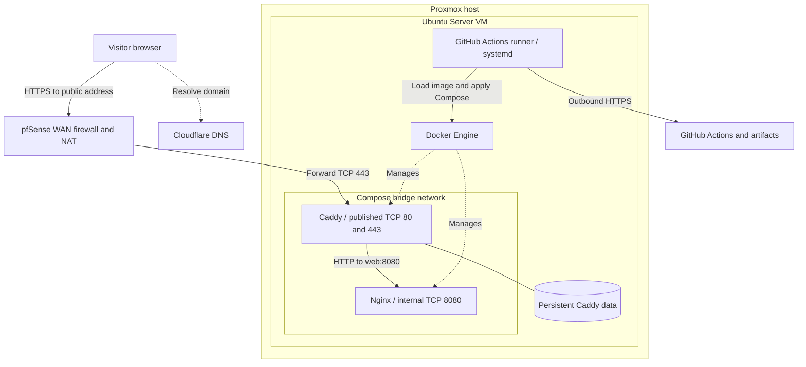
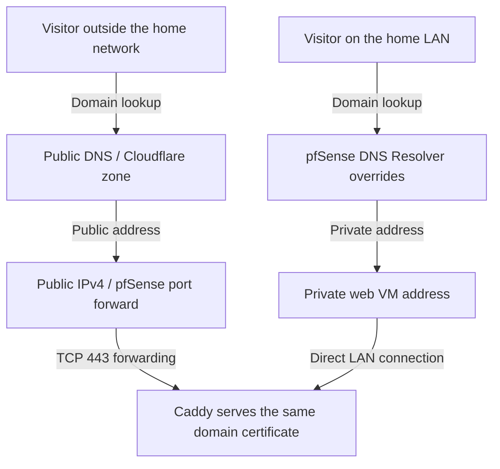
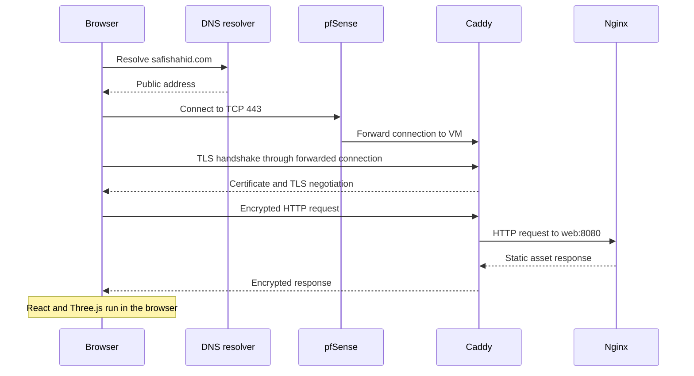
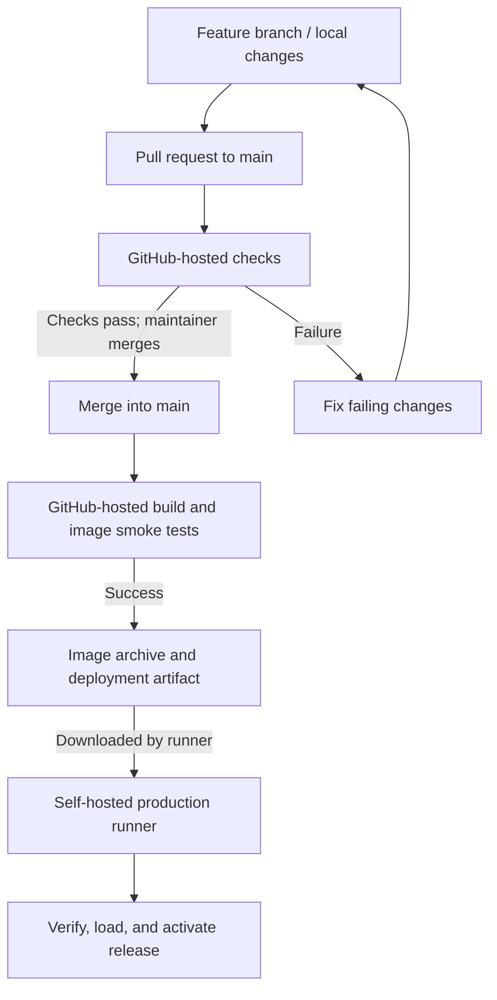
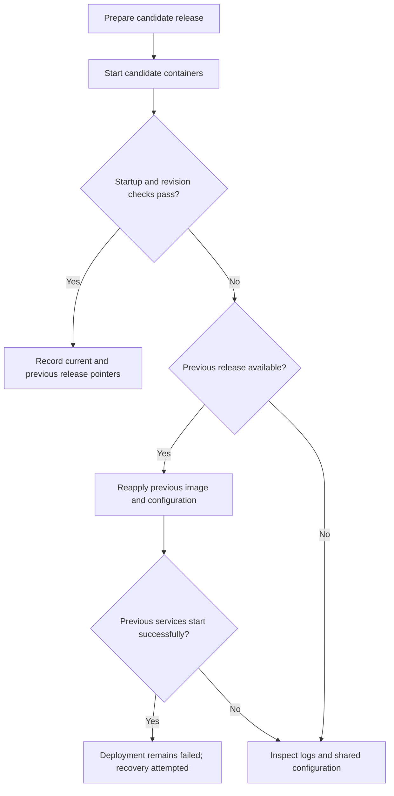

# Safi Shahid — Self-Hosted Portfolio Platform

**An interactive React and Three.js portfolio with automated delivery from GitHub to an Ubuntu Server VM on a Proxmox home lab.**

[Visit the portfolio](https://safishahid.com) · [LinkedIn](https://www.linkedin.com/in/safi-shahid/) · [GitHub profile](https://github.com/SafiShahid34)

I built and deployed this project to connect application development with the infrastructure that makes an application available to real users. The website presents my experience and projects; the platform behind it demonstrates containerization, CI/CD, Linux administration, network routing, DNS, certificate automation, release verification, and operational troubleshooting.

GitHub-hosted runners compile and check the application. A self-hosted runner on the production VM retrieves the resulting image and deployment files. Docker Compose runs two services: Caddy handles public HTTPS and reverse proxying, and Nginx serves the compiled website. Cloudflare provides domain registration and DNS; pfSense forwards inbound web traffic to the VM.

This repository is a **public engineering case study**. The application source and production workflows remain in a separate private repository. There is no production runner attached to this documentation repository, and cloning it does not provide a runnable copy of the application.

## Contents

- [Project at a glance](#project-at-a-glance)
- [Architecture](#architecture)
- [Application and rendering](#application-and-rendering)
- [Compute and resource usage](#compute-and-resource-usage)
- [Containers and runtime configuration](#containers-and-runtime-configuration)
- [Network and firewall design](#network-and-firewall-design)
- [Domain and DNS configuration](#domain-and-dns-configuration)
- [HTTPS and certificate lifecycle](#https-and-certificate-lifecycle)
- [CI/CD and release delivery](#cicd-and-release-delivery)
- [Health checks and rollback](#health-checks-and-rollback)
- [Security boundaries](#security-boundaries)
- [Operations and verification](#operations-and-verification)
- [Troubleshooting case studies](#troubleshooting-case-studies)
- [Source organization and local development](#source-organization-and-local-development)
- [Tradeoffs and next steps](#tradeoffs-and-next-steps)
- [Technical references](#technical-references)

## Project at a glance

| Area                                        | Implementation                                                                              |
| ------------------------------------------- | ------------------------------------------------------------------------------------------- |
| Application                                 | React, TypeScript, Vite, Three.js, React Three Fiber                                        |
| Presentation                                | Tailwind CSS, project CSS, GSAP with ScrollTrigger, Drei helpers, selective bloom           |
| Production web server                       | Nginx serving compiled static assets                                                        |
| Reverse proxy and TLS                       | Caddy                                                                                       |
| Packaging and orchestration                 | Docker images and Docker Compose                                                            |
| Hypervisor                                  | Proxmox VE                                                                                  |
| Guest operating system                      | Ubuntu Server 24.04 LTS                                                                     |
| VM allocation                               | 1 vCPU and approximately 4 GiB RAM                                                          |
| CI                                          | GitHub-hosted Linux runners                                                                 |
| Deployment agent                            | GitHub Actions runner installed as a systemd service on the VM                              |
| Domain and authoritative DNS                | Cloudflare; DNS-only records in the documented setup                                        |
| Network perimeter                           | pfSense with TCP 80 and TCP 443 forwarded to the web VM                                     |
| Host firewall                               | UFW; default inbound deny, outbound allow, SSH restricted to the administration LAN         |
| Release identification                      | Web image tagged with the full Git commit SHA; `/release.txt` exposes the deployed revision |
| Recovery                                    | Retained release directories and images; scripted, best-effort rollback                     |
| Application backend                         | None in the current site                                                                    |
| Database, authentication, visitor analytics | Not implemented                                                                             |

**Evidence and scope.** This document describes the deployment implementation supplied with the project and the configuration and terminal output recorded during the September 2026 rollout. Later domain changes are documented separately from the original LAN-only configuration. Resource measurements are snapshots, not benchmarks. The private repository and running VM remain authoritative for subsequent changes; no uptime SLA, load-test result, Lighthouse score, or complete security audit is claimed here.

## Architecture

### Production topology



The diagram separates two paths:

- **Visitor traffic:** browser → router → Caddy → Nginx. Cloudflare answers DNS queries; it is not an HTTP proxy in the documented DNS-only configuration.
- **Deployment traffic:** the VM runner communicates outward with GitHub, downloads an artifact, and instructs the local Docker Engine to activate a release.

The runner does not serve web requests. Docker does not contain the entire VM. The Ubuntu guest runs Docker and the runner as host services, while the two application containers share that guest's kernel. This is a Docker Compose deployment, not a Kubernetes cluster, Docker Swarm, or multi-node platform.

### Where work happens

| Location                   | Responsibilities                                                                                                     |
| -------------------------- | -------------------------------------------------------------------------------------------------------------------- |
| Development laptop         | Editing, local Vite preview, Git branches, local checks                                                              |
| GitHub-hosted build runner | Dependency installation, formatting checks, TypeScript checks, Vite build, image build, smoke tests, artifact upload |
| Ubuntu production VM       | Artifact download, checksum verification, image loading, container replacement, health and revision checks           |
| Caddy container            | TLS termination, HTTP-to-HTTPS redirection, reverse proxying, configured compression                                 |
| Nginx container            | Delivering HTML, JavaScript, CSS, images, the resume PDF, and health/revision endpoints                              |
| Visitor's browser          | React execution, Three.js/WebGL rendering, interaction, and local resume keyword search                              |

This placement keeps compilation and most build-time CPU usage off the small home VM. A visitor's 3D scene uses the visitor's graphics hardware; the server sends the assets needed to render it.

## Application and rendering

### User-facing experience

The site uses a monochrome interface with restrained motion, terminal-inspired controls, and readable resume content. Its sections cover the introduction, skills, experience, three project slots, and contact information.

| Section or feature | Implementation                                                                                                            |
| ------------------ | ------------------------------------------------------------------------------------------------------------------------- |
| Boot sequence      | Approximately 1.7 seconds in the supplied implementation; skippable by keyboard or pointer; remembered in session storage |
| Hero               | Wireframe geometry and a deterministic particle sphere, with pointer response and scroll animation                        |
| About              | Interactive skill-cluster graph with equivalent HTML controls and a complete text list                                    |
| Experience         | Semantic expandable entries accompanied by a lightweight pipeline visualization                                           |
| Projects           | Typed project data, `coming-soon` and `live` states, optional image/video previews, and external links                    |
| Contact            | Dotted globe with a Buffalo marker and illustrative connection arcs                                                       |
| Command palette    | Cmd/Ctrl + K opens section navigation                                                                                     |
| Resume terminal    | Backtick or the terminal button opens a browser-local command interface                                                   |
| Resume download    | A version-controlled PDF delivered as a static asset                                                                      |

The portfolio itself occupies the first project slot. The remaining slots can be filled without changing the component structure. The geographic arcs are visual illustrations, not telemetry or claims of infrastructure locations.

### Performance and accessibility decisions

The supplied scene wrapper lazy-loads the WebGL module and uses an `IntersectionObserver` to mount scenes near the viewport. Offscreen scenes are unmounted, releasing their rendering work. The observer uses an 80-pixel margin to give approaching scenes a small preparation window.

Canvas pixel density is capped at 1 on compact screens and at 1.5 on larger screens. Compact screens disable antialiasing and the hero bloom pass. The renderer requests a low-power preference. Particle positions are generated deterministically instead of using a simulation that must run on the server.

Reduced-motion settings switch the canvas to demand rendering and suppress continuous animation. The boot sequence and GSAP scroll effects also respect the user's motion preference. WebGL fallbacks and an error boundary allow the text, navigation, resume, and contact links to remain usable when a scene fails.

The design also includes semantic sections, a skip link, native disclosure controls, visible keyboard focus, and native dialog-based terminal/palette interfaces. The 3D graph has HTML equivalents so accessing skills does not depend on manipulating a canvas.

These are implementation choices, not measured claims of WCAG conformance or guaranteed 60 fps. The compact-screen setting is chosen when the canvas mounts; the supplied code does not implement a device benchmark or automatically reduce the particle count based on measured frame time. Lighthouse and real-device testing remain separate validation tasks.

### What “Ask my resume” actually does

The current assistant is a deterministic keyword search in the browser. It does not call an LLM or run a model on the home server.

`answerResumeQuestion(question)` lowercases and tokenizes the question, removes common words, scores resume passages by matching terms, and returns up to three matches. Its searchable material includes the bio, experience bullets, skills, education, certifications, and contact information. Explicit commands such as `projects` use the project data directly. If no passage matches, the response says that the information was not found.

The interface is deliberately separated from the answer function. A future backend could implement the same asynchronous function contract, but API credentials would stay on that backend. That would introduce new operating requirements: input validation, request limits, timeout handling, cost controls, and grounded answers.

The small session timer is a local interface feature. It does not measure server uptime, network latency, or service availability. No visitor-identification system has been implemented. The supplied page also requests Google Fonts; browser-local resume search does not mean the entire page makes no external requests.

## Compute and resource usage

### Actual recorded allocation

The VM's `nproc` output reported **1 vCPU**. `free -h` reported **3.8 GiB total guest memory**, consistent with an approximately 4 GiB allocation. This resolves the earlier uncertainty about whether the VM had 2 GiB or 4 GiB.

| Component       | Configured limit or allocation                                            | Recorded use                                                |
| --------------- | ------------------------------------------------------------------------- | ----------------------------------------------------------- |
| Ubuntu VM       | 1 vCPU; approximately 4 GiB RAM                                           | 685 MiB memory reported as used in one snapshot             |
| Caddy container | 0.50 CPU; 256 MiB memory; 100 PIDs                                        | 9.297 MiB memory and 0.00% CPU in one idle sample           |
| Nginx container | 0.50 CPU; 256 MiB memory; 100 PIDs                                        | 2.562 MiB memory and 0.00% CPU in the same sample           |
| Runner service  | Shares the VM's remaining resources; no explicit service limit documented | Approximately 39.5 MiB in a separate service-start snapshot |
| Swap            | 3.1 GiB shown by the guest                                                | 0 B used in the recorded snapshot                           |

The memory snapshot also showed approximately **2.7 GiB of buffers/cache** and **3.2 GiB available**. Linux can reclaim much of its filesystem cache. A high utilization figure in the hypervisor view therefore needed interpretation alongside the guest's `available` memory, swap use, and container statistics.

Container limits are ceilings. They do not reserve two dedicated half-cores or preallocate 256 MiB per container. Ubuntu, Docker, and the runner also need resources. The two container measurements above total approximately 11.9 MiB at that moment; that number excludes the operating system and is not a peak-load estimate.

The installer originally showed a 32 GB virtual disk with LVM space left unallocated. The final root filesystem size was not re-measured in the shared evidence. `lsblk`, `df -h`, and Docker disk-use reports are the appropriate checks before making a capacity claim.

A single small VM was sufficient for the observed operation of this static site. There is no recorded concurrent-user benchmark, bandwidth ceiling, or saturation test. Image loading, updates, logs, retained releases, and future services can change the resource profile.

## Containers and runtime configuration

### Nginx application image

The build first produces `dist/`. The Dockerfile copies that output into an Nginx Alpine image and writes the release revision into `/usr/share/nginx/html/release.txt`.

The runtime image executes Nginx as the `nginx` user and listens on port `8080`. It does not start a Node.js server or a Vite development process. The Dockerfile provides a health check against `http://127.0.0.1:8080/healthz`.

The Compose definition applies the following restrictions specifically to the **web service**:

```yaml
read_only: true
tmpfs:
  - /tmp:size=32m,mode=1777
cap_drop: [ALL]
security_opt: [no-new-privileges:true]
cpus: 0.50
mem_limit: 256m
pids_limit: 100
```

The read-only root filesystem prevents ordinary writes into the image filesystem. Nginx's PID and temporary files use `/tmp`, which is mounted as a small writable memory filesystem. Dropping Linux capabilities and disabling privilege gains reduce the process's available privileges. They do not make an application immune to vulnerabilities.

### Caddy reverse proxy

Caddy publishes host TCP ports `80` and `443`. It connects to the web service over the Compose network using the service name `web` and port `8080`.

Two named volumes preserve Caddy's state:

| Volume         | Container path | Purpose                                               |
| -------------- | -------------- | ----------------------------------------------------- |
| `caddy_data`   | `/data`        | Certificate, key, and related persistent runtime data |
| `caddy_config` | `/config`      | Caddy configuration state                             |

The Caddyfile is mounted read-only. Caddy has the same CPU, memory, PID, restart, and log-rotation settings as the web service in the supplied Compose file. The web service's non-root, read-only-root-filesystem, capability-drop, and no-new-privileges settings are **not** all applied to Caddy in that file. The documentation does not claim equivalent hardening for both containers.

### Networking, restarts, and logs

Only Caddy has published ports. Nginx has no direct host port mapping; Caddy reaches it through the `portfolio` network. This is a standard user-defined bridge network. It is not configured with `internal: true`, so the network definition is not an outbound-deny policy.

Both containers use `restart: unless-stopped`. This restarts exited containers under the policy's conditions; an `unhealthy` status by itself does not guarantee a container restart.

Docker's `json-file` driver is configured with a 5 MB maximum file size and two retained files per service. Nginx access logging is disabled in the supplied configuration, while its error log goes to standard error. The supplied Caddyfile does not enable request access logging. Container and runner operational logs still exist.

### Static files and caching

| Path                      | Intended behavior in the supplied Nginx configuration                            |
| ------------------------- | -------------------------------------------------------------------------------- |
| `/` and `/index.html`     | Serve the application entry point; the HTML is configured for cache revalidation |
| `/assets/`                | Serve Vite's content-hashed assets with a long-lived immutable cache policy      |
| `/Safi-Shahid-Resume.pdf` | Serve the resume with `Cache-Control: no-cache`                                  |
| `/healthz`                | Return a lightweight `200` response with `ok`                                    |
| `/release.txt`            | Return the image revision with `Cache-Control: no-store`                         |
| Missing files             | Return `404` in the supplied production Nginx configuration                      |

`no-cache` permits storage but requires revalidation before reuse. `no-store` instructs caches not to store the response. Hash-named assets can be cached longer because a changed file gets a different URL.

Both Nginx and Caddy have compression configured. This is configuration overlap, not evidence that responses are compressed twice or a measured performance improvement. It can be simplified after checking actual response behavior.

## Network and firewall design

Public examples use these symbolic names rather than publishing the home's WAN address:

| Symbol           | Meaning                                                     |
| ---------------- | ----------------------------------------------------------- |
| `PUBLIC_IPV4`    | Current internet-facing IPv4 address of the home connection |
| `WEB_VM_IP`      | Private LAN address of the Ubuntu VM                        |
| `ADMIN_LAN_CIDR` | IPv4 subnet permitted to administer the VM over SSH         |

### pfSense ingress rules

The public website uses two explicit IPv4 port forwards:

| Interface | Protocol | Public destination    | Redirect target | Purpose                                                          |
| --------- | -------- | --------------------- | --------------- | ---------------------------------------------------------------- |
| WAN       | TCP      | WAN address, port 80  | `WEB_VM_IP:80`  | HTTP redirection and HTTP-based certificate validation when used |
| WAN       | TCP      | WAN address, port 443 | `WEB_VM_IP:443` | Public HTTPS and TLS-based certificate validation when used      |

Each forward needs a matching firewall pass rule; the setup used the associated filter-rule option. Source ports remain unrestricted because browsers use temporary client ports. Port 80 and port 443 are separate rules, not a broad `80–443` range. No WAN port-forward was intentionally added for SSH, the Docker API, Prometheus, Proxmox management, or the pfSense administration interface.

These rules publish the web service through the router. They do not make the private VM address globally routable. They also do not isolate a compromised VM from the rest of the LAN; a separate DMZ/VLAN would be a further network-design step.

The documented setup publishes TCP, not UDP 443. HTTP/3 availability is therefore not claimed. It also does not establish an IPv6 publication design; globally routed IPv6 requires its own perimeter policy.

### UFW host policy

The recorded rules were equivalent to the following. These are explanatory examples: the variables must contain the administrator's real subnet before any command is used on another machine.

```bash
# Deny unsolicited inbound host traffic by default.
sudo ufw default deny incoming

# Permit outbound connections, including updates and runner communication.
sudo ufw default allow outgoing

# Allow SSH from the designated administration LAN only.
sudo ufw allow from "$ADMIN_LAN_CIDR" to any port 22 proto tcp

# Permit inbound website ports.
sudo ufw allow 80/tcp
sudo ufw allow 443/tcp

# Record low-volume firewall events.
sudo ufw logging low
```

UFW was enabled after the SSH allow rule was added. Its recorded status was active, with default incoming deny, outgoing allow, and routed deny. Web rules were shown for both IPv4 and IPv6; the SSH allowance was for the specified IPv4 LAN. SSH and HTTP connectivity from the Windows laptop were subsequently tested successfully.

**Docker interaction:** published container traffic can be routed through Docker's firewall/NAT rules before ordinary UFW filtering applies. UFW alone is therefore not the security boundary for published containers. The narrow Compose port mappings and pfSense WAN rules are material parts of this design. A container-aware firewall policy remains an explicit improvement area. [Docker firewall reference](https://docs.docker.com/engine/network/packet-filtering-firewalls/)

### Administrative and outbound access

SSH provides LAN administration. The GitHub runner initiates outbound HTTPS communication; GitHub does not need an inbound SSH session to the home network for this deployment. Certificate issuance, package updates, DNS, and image retrieval also need outbound connectivity. The host policy permits outgoing traffic broadly; it is not an egress allowlist.

Creating `portfolio-runner` with a disabled password separated its files and process identity from the interactive administrator account. Membership in the Docker group gave it the permissions needed to deploy, with the privilege implications described below.

## Domain and DNS configuration

The domain is registered with Cloudflare. The documented public DNS records are:

| Record | Name                   | Target           | Proxy status |
| ------ | ---------------------- | ---------------- | ------------ |
| A      | `@` / `safishahid.com` | `PUBLIC_IPV4`    | DNS only     |
| CNAME  | `www`                  | `safishahid.com` | DNS only     |

With DNS-only records, clients resolve the origin address and connect to the home network. Cloudflare's HTTP cache, application firewall, and edge TLS termination are not in this request path. Buying a domain or using Cloudflare DNS does not by itself enable those proxy services. [Cloudflare proxy-status reference](https://developers.cloudflare.com/dns/proxy-status/)

No working AAAA record or public IPv6 path was established in the recorded setup. No dynamic DNS updater was demonstrated. If the ISP changes the public IPv4 address, the A record must be updated manually or through a future automation.

Additional websites could share the same public IP and HTTPS port by using distinct hostnames and Caddy site blocks that select different upstream services. They do not each need a different public port. In the current deployment, the apex and `www` both identify this one application; multiple independently hosted applications have not been implemented.

### Split DNS for access from home

The site initially worked from other networks but returned a pfSense DNS-rebinding warning from the home LAN. Internal clients were reaching the router's web interface rather than the intended website.

Host overrides in the pfSense DNS Resolver allow the same names to resolve directly to the web VM for local clients:

| Internal hostname    | Resolver answer |
| -------------------- | --------------- |
| `safishahid.com`     | `WEB_VM_IP`     |
| `www.safishahid.com` | `WEB_VM_IP`     |



The diagram shows the address selected by each resolver and the resulting connection route. DNS resolvers do not relay the website's HTTP traffic.

For the overrides to work, the client must use that resolver. A browser using a separate encrypted-DNS provider may receive the public answer instead. Each hostname needs coverage; fixing the apex alone does not fix `www`. This design avoids depending on NAT reflection for ordinary LAN access. [pfSense split-DNS reference](https://docs.netgate.com/pfsense/en/latest/nat/reflection.html#split-dns)

DNS-rebinding protection did not need to be disabled. The internal warning was a routing/name-resolution diagnostic, not proof that pfSense administration had been intentionally exposed to the internet.

## HTTPS and certificate lifecycle

### Moving from LAN HTTP to domain-based HTTPS

The original Caddyfile accepted its address from the container environment:

```caddyfile
{$SITE_ADDRESS} {
    encode zstd gzip
    reverse_proxy web:8080
}
```

During LAN setup, `SITE_ADDRESS=:80` served plain HTTP. When using that parameterized file, `SITE_ADDRESS=safishahid.com` supplies a hostname; `SITE_ADDRESS=:safishahid.com` is invalid because the leading colon makes Caddy interpret the text as a port.

The subsequent domain configuration included both hostnames. An equivalent configuration for that behavior is:

```caddyfile
safishahid.com, www.safishahid.com {
    encode zstd gzip
    reverse_proxy web:8080
}
```

With literal hostnames in the Caddyfile, `SITE_ADDRESS` no longer controls those site addresses. Both names serve the site; this block does not implement a canonical redirect from `www` to the apex.

### TLS responsibilities

Caddy uses automatic HTTPS to obtain and renew publicly trusted certificates for configured hostnames and redirect HTTP requests to HTTPS. Successful automation depends on correct DNS, network reachability for the selected ACME challenge, and persistent writable certificate storage. The `/data` volume carries that state across container replacement. The deployment does not use a manually installed self-signed certificate, a Cloudflare Origin CA certificate, or a separate certificate-management container. [Caddy automatic HTTPS](https://caddyserver.com/docs/automatic-https)

The precise issuer and expiry should be read from the currently served certificate; they are not fixed project constants. Browser inspection during troubleshooting showed a valid, trusted certificate and a TLS 1.3 connection.

### Request sequence



pfSense forwards the connection; Caddy terminates TLS. The Caddy-to-Nginx hop uses HTTP on the Docker bridge, so transport encryption ends at Caddy. The bridge is not an encrypted network. Access to the host and Docker Engine is therefore a security boundary.

The certificate is checked against the hostname used in the browser. Internal split DNS can point that hostname at a private address without invalidating its public certificate. Browsing directly to the private IP over HTTPS is a different certificate-name check and is not the preferred access path.

## CI/CD and release delivery

### Repository workflow

The application lives in the private `Safi-Website` repository. Changes are developed on feature branches and reviewed through pull requests into `main`. The public documentation repository is independent and has no deployment authority.



The workflow automates checks and deployment. It does not establish that GitHub automatically merges pull requests. Required reviews, required status checks, and branch protection must be configured separately; their enforcement was not demonstrated in the available records.

### Pull-request validation

The supplied `.github/workflows/ci.yml` runs on pull requests targeting `main` and uses a GitHub-hosted Ubuntu runner. It executes:

```bash
npm ci                 # Install the lockfile's dependency set.
npm run format:check   # Check formatting without rewriting source.
npm run build          # Run TypeScript checks, then produce the Vite build.
```

These are formatting, type, and build checks. The supplied portfolio workflow does not contain a unit-test suite, an end-to-end browser suite, a vulnerability-scanning gate, or a Lighthouse gate. Npm's incidental audit output is not a substitute for those controls.

### Main-branch build

The deployment workflow is triggered by a push to `main`, including a merged pull request. It also supports manual dispatch, while its job conditions restrict execution to `main`.

The build job:

1. Checks out the source without persisting Git credentials in the checkout.
2. Selects Node from `.nvmrc`; the supplied project specifies Node 22.
3. Installs dependencies using `npm ci`, checks formatting, and builds the application.
4. Creates `safi-portfolio:<full-commit-sha>` from the compiled static files.
5. Starts a temporary, constrained container bound to the build runner's loopback interface.
6. Checks the health endpoint, a homepage marker, the exact release revision, and the downloaded PDF against the checked-in PDF bytes.
7. Exports the tested image with `docker save`, compresses it as `image.tar.gz`, and generates a SHA-256 checksum.
8. Uploads the image and deployment files as an artifact named for the commit.

The artifact also includes `compose.yaml`, `Caddyfile`, `deploy.sh`, and `rollback.sh`. Retention is set to three days in the supplied workflow. Image archives are already compressed, so the artifact upload disables additional compression.

The PDF comparison proves byte consistency with the committed asset. It does not independently prove that the committed file is a valid or readable PDF. Likewise, a homepage text check is not a visual regression test.

### Production deployment

The deploy job requires a successful build, `main`, and the repository variable `DEPLOY_ENABLED=true`. It targets runner labels `self-hosted`, `Linux`, `X64`, and `portfolio-deploy`.

The runner is installed under the dedicated `portfolio-runner` account and managed by systemd. It remains available after an SSH session closes. The production job downloads the artifact, invokes the included deployment script, and cleans up temporary transfer files. It does not check out the source or run `npm` on the VM.

The deployment script performs these operations:

| Stage             | Behavior                                                                          |
| ----------------- | --------------------------------------------------------------------------------- |
| Validate inputs   | Require a full 40-character commit SHA and the production environment file        |
| Serialize changes | Acquire a local `flock` lock to reject overlapping deployment/rollback operations |
| Verify transfer   | Check the compressed image archive against `image.sha256`                         |
| Import image      | Decompress the archive and load it into Docker's local image store                |
| Prepare release   | Copy deployment configuration into a SHA-named release directory                  |
| Validate Compose  | Run Compose configuration validation                                              |
| Activate          | Apply the selected image and configuration with `docker compose up -d --wait`     |
| Check revision    | Retrieve `/release.txt` from the web service and compare it to the requested SHA  |
| Record success    | Update `current` and, when appropriate, `previous` symlinks                       |

Loading the image only adds it to Docker's image store. Container creation/replacement activates it. An `image.tar.gz` file sitting on disk is an artifact, not a running application.

The workflow uses a production concurrency group with in-progress cancellation disabled. Together with the VM lock, this reduces the risk of overlapping replacements. It does not create a highly available deployment system or guarantee that every queued intermediate commit will receive a separate production rollout.

### Release storage

| Path                                  | Purpose                                                                |
| ------------------------------------- | ---------------------------------------------------------------------- |
| `/opt/safi-portfolio/production.env`  | Shared environment configuration outside the source repository         |
| `/opt/safi-portfolio/deploy.lock`     | Lock used by deployment and rollback                                   |
| `/opt/safi-portfolio/releases/<sha>/` | Compose file, Caddyfile, rollback script, and revision for one release |
| `/opt/safi-portfolio/current`         | Symlink identifying the last release recorded as successful            |
| `/opt/safi-portfolio/previous`        | Symlink to the retained previous successful release                    |
| Docker local image store              | Runtime images, including retained rollback candidates                 |

The release directory does not contain the application's source checkout or a second copy of the running VM. The application assets are inside the Docker image. The production workflow uses GitHub artifacts rather than a separately operated container registry.

## Health checks and rollback

### What each check proves

| Check                     | What it establishes                                  | What it does not establish                         |
| ------------------------- | ---------------------------------------------------- | -------------------------------------------------- |
| TypeScript/Vite build     | Source type checks and compilation succeed           | Correct business behavior or browser appearance    |
| `/healthz`                | Nginx responds on its configured endpoint            | All assets, DNS, TLS, or WAN accessibility work    |
| Build-time homepage check | Expected text is in the served HTML                  | React rendering and WebGL work correctly           |
| PDF byte comparison       | Served PDF bytes match the repository file           | Correct PDF contents, formatting, or accessibility |
| `/release.txt`            | The web service exposes the requested revision       | Every old browser session has refreshed            |
| External HTTPS request    | The tested public DNS/network/TLS/request path works | Continuous availability from every network         |

The supplied deployment script executes `wget` inside Caddy to request `http://web:8080/release.txt`. That tests Caddy-container-to-web connectivity and the application revision. It does **not** make a request through Caddy's public HTTPS listener.

The baseline Dockerfile explicitly defines the web health check. Later deployment logs reported Caddy as healthy as well, but the exact later Caddy probe definition was not captured in the files reviewed for this document. A green container status is therefore not presented as proof of certificate validity or internet reachability.

### Recovery behavior



Failures after the script arms its error handler trigger an attempt to start the previous release. A separate rollback script can restore a retained prior release manually. Docker images must still exist locally for this to work.

Recovery is **best effort**. Both releases share host conditions, persistent volumes, and `production.env`; reverting an image cannot fix a bad shared environment value, broken network path, missing certificate storage, full disk, or host outage. An early checksum/configuration failure also has different recovery behavior from a failure during activation.

The manual rollback script waits for Compose startup but does not repeat every public-path check. Both automatic and manual recovery should be followed by independent revision and HTTPS verification. The recorded failed Caddy deployment demonstrated this limitation: the same invalid shared hostname setting also affected the attempted rollback.

This is an in-place replacement strategy. A brief interruption is possible while containers are replaced, and an old browser tab can request assets from a previous build. There is no blue/green switch, distributed load balancer, or zero-downtime guarantee.

## Security boundaries

### Implemented controls

| Layer                 | Recorded or source-defined control                                               | Important boundary                                                                  |
| --------------------- | -------------------------------------------------------------------------------- | ----------------------------------------------------------------------------------- |
| Perimeter             | Specific web-port forwards                                                       | Protects internet ingress according to the router rules; does not segment the LAN   |
| Host                  | Active UFW and LAN-scoped SSH allowance                                          | Docker-published traffic requires separate consideration                            |
| TLS                   | Caddy-managed public HTTPS                                                       | Caddy terminates encryption; internal upstream uses HTTP                            |
| Application container | Non-root Nginx, read-only root filesystem, reduced capabilities, resource limits | Applies to the web container as defined, not automatically to every host process    |
| Source control        | Private application/deployment repository                                        | Privacy does not eliminate risks from trusted accounts or dependencies              |
| Workflow routing      | PR builds on GitHub-hosted runners; production deployment gated to main          | A workflow condition is not a replacement for repository access controls            |
| Runner identity       | Dedicated Linux account                                                          | Docker group access remains highly privileged                                       |
| Configuration         | Production environment outside Git; mode `600` in the setup                      | Owner and root can read it; it is shared across releases                            |
| Transfer              | SHA-256 check of the image archive                                               | Detects inconsistency; it is not an image signature or independent provenance proof |
| Resource containment  | CPU, memory, PID and log limits for the two services                             | Does not rate-limit public requests or protect the home link against flooding       |

### Runner trust

Docker documents that membership in the `docker` group grants root-level privileges. The deployment account can control the host's Docker daemon; it should be treated as a privileged production identity. The separate user improves ownership and process separation, but it is not a strong sandbox. [Docker Linux post-installation reference](https://docs.docker.com/engine/install/linux-postinstall/)

The main deployment artifact includes an executable script. The VM trusts that script because it comes from the trusted build workflow. A compromised workflow or sufficiently privileged repository account could therefore affect the production host. The checksum travels with the artifact and covers the image archive; it does not independently authenticate the artifact's producer or hash every deployment file.

The documentation repository should remain disconnected from the production runner. Public pull-request code must not run on that host. The private application's supplied workflow keeps PR checks on GitHub-hosted machines; additional controls such as required reviews, protected branches, constrained runner access, full-SHA action pinning, and isolated deployment infrastructure are further hardening steps rather than claims already established here. [GitHub Actions security guidance](https://docs.github.com/en/actions/reference/security/secure-use)

### Headers and verification gap

The supplied Nginx server block configures `X-Content-Type-Options: nosniff`, `Referrer-Policy: strict-origin-when-cross-origin`, and `X-Frame-Options: DENY`.

However, several location blocks add their own `Cache-Control` header. Nginx's default `add_header` inheritance means a child location with an `add_header` can stop inheriting its parent's headers. Consequently, this README does not claim that every response carries all three security headers. The deployed responses must be checked, and the configuration should be adjusted deliberately if coverage is incomplete. [Nginx header-inheritance reference](https://nginx.org/en/docs/http/ngx_http_headers_module.html)

No enforced Content Security Policy, HSTS policy, WAF, rate limiter, or completed external vulnerability assessment was demonstrated. Those controls should be evaluated and tested rather than listed as existing features.

### Prometheus discovery

An inspection of listening ports found Prometheus on port `9090`. It was installed as the `prometheus` snap, and `snap services prometheus` reported it as enabled and active. The absence of a unit named `prometheus.service` did not mean that the snap service was stopped.

No public forward or UFW allow rule for `9090` was added in the recorded policy. Scrape targets, dashboards, alert rules, authentication, and subsequent removal or reconfiguration were not demonstrated. The project therefore does not claim a completed Prometheus monitoring stack. This service should be reviewed separately if retained.

## Operations and verification

The following commands are an operational reference, not evidence that each has been run after every later change. Commands marked Windows run in PowerShell on the laptop; Linux commands run in the VM's SSH shell.

### Host and container state — Linux

```bash
nproc                                  # CPU count visible to the guest.
free -h                                # Memory, cache, available memory, and swap.
lsblk                                  # Virtual disks, partitions, and logical volumes.
df -h                                  # Filesystem capacity and use.
sudo docker stats --no-stream           # A point-in-time container resource sample.
sudo docker system df                   # Space used by images, containers, and volumes.
sudo docker ps -a --filter name=safi-portfolio
sudo ufw status verbose                # Current host firewall rules and defaults.
sudo ss -tulpn                         # Listening TCP/UDP ports and owning processes.
sudo snap services prometheus          # State of the separately installed snap service.
```

Inspect the production runner and recent proxy messages:

```bash
# Run from the administrator account; the runner is managed by systemd.
sudo bash -c 'cd /home/portfolio-runner/actions-runner && ./svc.sh status'

# Read recent runtime logs; these commands do not change containers.
sudo docker logs --tail 100 safi-portfolio-caddy-1
sudo docker logs --tail 100 safi-portfolio-web-1

# Validate the Caddyfile inside an already-running Caddy container.
sudo docker exec safi-portfolio-caddy-1 caddy validate --config /etc/caddy/Caddyfile --adapter caddyfile
```

`docker exec` cannot reliably inspect a container that is repeatedly restarting. In that case, begin with `docker logs` and inspect the release's mounted configuration and environment references. Do not repeatedly restart the container in place of reading the first configuration error.

### Use the actual Compose context — Linux

Running `docker compose ps` in the administrator's home directory can fail because no Compose file is there. The deployed configuration belongs to a release directory. For an established deployment with a valid `current` pointer:

```bash
# Enter the deployment account so its files and Docker access are used.
sudo -iu portfolio-runner

# Resolve the configuration associated with the last successful release.
release_dir="$(readlink -f /opt/safi-portfolio/current)"

# Supply the revision, environment file, and Compose path explicitly.
IMAGE_TAG="$(cat "$release_dir/revision")" docker compose --project-name safi-portfolio --env-file /opt/safi-portfolio/production.env --file "$release_dir/compose.yaml" ps

exit  # Return to the administrator's shell.
```

After a failed rollout, the `current` pointer can still identify the last recorded successful release while Docker is in a different intermediate state. Inspect actual container image IDs and logs as well; a symlink is not a live health signal.

### Public-path checks — Windows PowerShell

```powershell
# Check each hostname independently.
Resolve-DnsName safishahid.com
Resolve-DnsName www.safishahid.com

# Use curl.exe explicitly so PowerShell does not substitute a web-request alias.
curl.exe -I http://safishahid.com
curl.exe -I https://safishahid.com
curl.exe -I https://www.safishahid.com

# Compare this result with the release expected from GitHub Actions.
curl.exe -fsS https://safishahid.com/release.txt

# Inspect the resume's HTTP status and content type.
curl.exe -I https://safishahid.com/Safi-Shahid-Resume.pdf
```

Expect HTTP to redirect to HTTPS, a successful HTTPS response for each configured name, and a PDF response at the resume URL. Do not use `-k` to declare certificate validation successful. A `HEAD` request checks headers, not the visual content; open the PDF and website as well.

Test from both the LAN and an external network such as a phone on cellular data. The LAN test exercises split DNS; the external test exercises public DNS and the WAN forwarding path. `Test-NetConnection` is a Windows PowerShell command, which explains why it was not recognized in the Linux shell during setup.

### Manual recovery — Linux

**This action changes the running release.** Use it only when intentionally restoring a retained previous deployment, and when no deployment job is active:

```bash
sudo -iu portfolio-runner                     # Use the deployment account.
bash /opt/safi-portfolio/current/rollback.sh   # Restore the retained previous release.
exit                                         # Return to the administrator account.
```

The script requires valid `current` and `previous` release pointers and the necessary local images. After it finishes, inspect container state and verify both `/release.txt` and external HTTPS. Shared configuration may still need repair if it caused the original failure.

### Maintenance boundaries

Retain the previous image before pruning Docker storage. A release directory without its image is not a working rollback candidate. Avoid deleting Caddy's named volumes during an ordinary deployment; they carry certificate state.

Backups should eventually cover the production configuration, useful release metadata, Caddy state, and the VM recovery procedure. The project has not demonstrated a scheduled backup policy or restoration test. Secrets and certificate private keys belong in restricted backup storage, not this public repository.

Operating-system, Docker, runner, and base-image updates need their own maintenance process. Commit-SHA application tags identify releases, but the supplied `nginx:stable-alpine` and `caddy:2-alpine` base tags are mutable. Byte-for-byte reproducible rebuilds and automatic proxy-image updates are not guaranteed by that tagging scheme.

## Troubleshooting case studies

### 1. Dependency installation failed in the wrong directory

**Symptom:** `npm ci` reported that it needed an existing lockfile.

**Evidence:** the initial command ran in the outer extracted folder. Changing into the nested application directory allowed the installation to complete.

**Lesson:** identify the directory containing both `package.json` and `package-lock.json` before changing dependencies. A missing lockfile error can be a working-directory mistake; generating a new dependency graph is not the first repair for that situation.

### 2. Local development commands did not match the project

**Symptom:** `npm start` reported a missing script, and a separate shell initially did not recognize `git`.

**Diagnosis:** the Vite project exposes `dev`, `build`, and `preview` scripts rather than a `start` script. Git must also be installed and available to the shell before repository commands work.

**Lesson:** use `npm run` to inspect available scripts and `git --version` to verify the tool installation. The local preview uses `npm run dev`; the production server uses Nginx.

### 3. A successful workflow did not mean a deployment happened

**Symptom:** GitHub showed a successful build and an artifact, while the deploy job was skipped.

**Diagnosis:** the workflow deliberately gates deployment on the main branch and `DEPLOY_ENABLED=true`, with a matching self-hosted runner required to execute it.

**Lesson:** inspect individual jobs and their conditions. A green overall run can include intentionally skipped jobs. Runner availability, labels, branch conditions, and repository variables are separate checks.

### 4. Compose could not find its configuration

**Symptom:** `docker compose ps` returned `no configuration file provided: not found` while the website itself responded successfully.

**Diagnosis:** the command ran outside the release directory and did not specify a Compose file.

**Lesson:** service failure and CLI context errors are different problems. Use the actual release path and environment, rather than assuming the administrator's home directory contains deployment files.

### 5. Caddy entered a restart loop after the domain change

**Symptom:** the web container remained healthy while Caddy restarted. Its log reported an invalid port containing `safishahid.com`.

**Evidence:** `production.env` contained `SITE_ADDRESS=:safishahid.com`.

**Resolution:** remove the colon when supplying a hostname to the parameterized Caddyfile, then recreate through the deployment process so the changed environment is applied. The later hostname configuration also covered `www`.

**Lesson:** `:80` is a port-only address, while `safishahid.com` is a hostname. Restarting an existing container does not update its originally supplied environment. Compose syntax validation alone does not validate a mounted Caddyfile's application-level semantics.

**Recovery finding:** reverting the release did not inherently repair the shared environment file. Rollback needs known-good dependencies as well as an older image. The failed run also emitted repeated rollback messages; the error-handler path should be reviewed before it is described as a one-shot or guaranteed recovery mechanism.

### 6. External access worked while the home LAN hit pfSense

**Symptom:** the domain worked on another network but displayed a DNS-rebinding warning from pfSense at home.

**Resolution:** configure local resolver overrides for both the apex and `www`, mapping them to the private web VM, then allow cached DNS answers to refresh.

**Lesson:** separate DNS answers, router reflection behavior, and the destination actually answering the request. There was no reason to disable rebinding protection or replace the site's certificate to solve that routing symptom.

### 7. Chrome reported broken HTTPS despite a valid certificate

**Symptom:** a regular Chrome profile showed a security warning while another browsing context worked. The Security panel reported a valid, trusted certificate and secure TLS, but also remembered content previously permitted with certificate errors.

**Resolution:** after checking that the certificate and destination were correct, a full browser restart through `chrome://restart` cleared the stale state and the user confirmed normal behavior.

**Lesson:** distinguish a current certificate failure from browser state left over from earlier misrouting or exceptions. Restarting a browser is not a general remedy for an expired, mismatched, or untrusted certificate, and accepting certificate errors is not the fix.

### 8. The resume downloaded as an HTM file

**Symptom:** the local site's resume link downloaded HTML after a replacement PDF was added.

**Diagnosis:** the configured URL targets `/Safi-Shahid-Resume.pdf`, corresponding to `public/Safi-Shahid-Resume.pdf`. Placing it under `public/project/` or `public/projects/` creates a different URL. Vite's development fallback can return the application's HTML for a missing asset request.

**Verification:** request the PDF URL directly, inspect the response type, and open the downloaded file. The supplied production Nginx configuration returns `404` for missing files rather than the same development fallback.

**Lesson:** the download attribute does not convert HTML into a PDF. Match the directory, filename, extension, and case. The later PDF replacement was not independently validated in the evidence used for this document, so this remains a verification procedure rather than a claimed completed fix.

### 9. An explicit push updated an unexpected branch

**Symptom:** while checked out on `resume-adj`, an explicit push named `fix-caddy-www` and updated that remote branch.

**Diagnosis:** the branch argument to `git push origin <branch>` selects which local branch is pushed. It does not automatically mean the current checkout. The new resume commit and the Caddy branch update were separate operations.

**Lesson:** confirm the current branch and staged diff, then use `git push -u origin HEAD` when the intention is to publish the current feature branch. Review the PR's base and compare branches before merging. A correct diagnosis does not establish that any subsequent branch recovery was executed.

## Source organization and local development

The following paths describe the **private application repository**, not files supplied by this public case study:

| Path                            | Responsibility                                                      |
| ------------------------------- | ------------------------------------------------------------------- |
| `src/data/profile.ts`           | Profile, contact information, education, resume URL, and navigation |
| `src/data/skills.ts`            | Skill groups and descriptions                                       |
| `src/data/experience.ts`        | Roles, dates, summaries, and experience bullets                     |
| `src/data/projects.ts`          | Three project entries, publication status, previews, and links      |
| `src/sections/`                 | Hero, About, Experience, Projects, and Contact components           |
| `src/components/`               | Shared UI, boot sequence, and command interface                     |
| `src/three/Scene.tsx`           | Lazy loading, viewport observation, fallback boundary               |
| `src/three/SceneCanvas.tsx`     | Canvas setup, geometry, interaction, and optional bloom             |
| `src/lib/resumeAssistant.ts`    | Browser-local commands and keyword search                           |
| `src/styles.css`                | Layout, typography, responsive rules, and motion preferences        |
| `public/Safi-Shahid-Resume.pdf` | Exact downloadable resume asset                                     |
| `public/projects/`              | Project preview images or videos                                    |
| `Dockerfile`                    | Static-file runtime image                                           |
| `deploy/`                       | Nginx, Caddy, Compose, deployment, and rollback configuration       |
| `.github/workflows/ci.yml`      | Pull-request checks                                                 |
| `.github/workflows/deploy.yml`  | Main-branch build, artifact delivery, and deployment                |
| `AGENTS.md`                     | Project-specific instructions for future coding assistance          |

Authorized maintainers use the application's lockfile and the Node version in `.nvmrc`:

```bash
npm ci                 # Install the recorded dependencies.
npm run dev            # Start the local development server.
npm run format:check   # Check formatting.
npm run build          # Check TypeScript and create dist/.
npm run preview        # Preview the completed static build locally.
```

The supplied development and preview scripts bind to `0.0.0.0`, making them potentially reachable on the local network. They are development tools and are not the publicly exposed production service.

Content is kept in typed data files so routine resume edits do not require redesigning components. Project publication uses `status: 'live'`; a presentation label such as `ACTIVE` is separate from that TypeScript value. Resume files placed directly in `public/` are served from the site root. [Vite public-assets reference](https://vite.dev/guide/assets.html#the-public-directory)

The build is static, but the main application is client-rendered React. “Static hosting” does not mean that the full interactive resume is rendered without JavaScript. SEO metadata exists in `index.html`; canonical and Open Graph URLs should be checked against the current domain because the original package included an earlier preview-host image URL.

## Tradeoffs and next steps

### Why this design

| Decision                          | Benefit                                                          | Cost or limitation                                                                  |
| --------------------------------- | ---------------------------------------------------------------- | ----------------------------------------------------------------------------------- |
| Static frontend                   | Small runtime footprint and no application database              | New dynamic features need a backend                                                 |
| Build on GitHub                   | Keeps compilation off the home VM                                | Depends on GitHub availability, artifact retention, and account allowances          |
| Artifact-based image transfer     | Deploys the image tested by the build job                        | No registry lifecycle or signing system is provided automatically                   |
| Caddy plus Nginx                  | Separates TLS/proxy configuration from the application image     | Caddy could also serve static files; two services add configuration to maintain     |
| Self-hosted deployment runner     | Automates local Docker operations without inbound deployment SSH | Places a privileged automation process on production                                |
| One VM                            | Simple operation and enough headroom in observed idle use        | Host, storage, power, router, and ISP remain shared failure points                  |
| DNS-only publication              | Direct, understandable request path                              | No Cloudflare HTTP proxy protection; the origin address is discoverable through DNS |
| Split DNS                         | Same hostname works inside and outside the LAN                   | Internal clients must use the intended resolver                                     |
| In-place deployment               | Small resource footprint and straightforward release management  | Brief interruption and stale-client asset failures are possible                     |
| Private source, public case study | Recruiters can inspect the engineering explanation               | Public readers cannot independently audit the complete source from this repository  |

### Planned improvements, not completed claims

- Verify the current Caddy health-check definition and add an explicit check through the public HTTPS path after activation and rollback.
- Fix and verify Nginx header inheritance, then evaluate CSP and HSTS against actual application behavior.
- Review repository permissions, branch rules, workflow/action pinning, dependency updates, and production runner isolation.
- Put internet-facing workloads on a separately controlled network segment and design container-aware filtering.
- Stabilize the VM address with a confirmed reservation or static assignment, and automate public DNS updates if the ISP address is dynamic.
- Establish external availability checks, certificate-expiry monitoring, useful alerting, backup retention, and a tested restore procedure.
- Review whether the incidental Prometheus snap should become an intentionally configured monitoring service or be removed.
- Record production Lighthouse results, browser performance measurements, accessibility checks, and a representative load test.
- Define image/release retention so disk use stays bounded without removing the active rollback candidate.
- Consider digest-pinned base images and a deliberate process for updating the proxy and runtime images.
- Add analytics only as a separately scoped feature with defined data collection and retention. A page visit alone does not reveal a visitor's verified identity.
- Add a server-side resume assistant only when there is a clear need, with secrets and controls outside the frontend bundle.

## Technical references

These primary references explain platform behavior. The project-specific configuration and measurements come from the application package and deployment records.

- [Caddy: automatic HTTPS](https://caddyserver.com/docs/automatic-https)
- [Caddy: site addresses and configuration concepts](https://caddyserver.com/docs/caddyfile/concepts#addresses)
- [Caddy: reverse proxy configuration](https://caddyserver.com/docs/caddyfile/directives/reverse_proxy)
- [Caddy: command-line validation](https://caddyserver.com/docs/command-line#caddy-validate)
- [Docker: packet filtering and firewalls](https://docs.docker.com/engine/network/packet-filtering-firewalls/)
- [Docker: Linux post-installation and Docker group privileges](https://docs.docker.com/engine/install/linux-postinstall/)
- [GitHub: self-hosted runners](https://docs.github.com/en/actions/concepts/runners/self-hosted-runners)
- [GitHub: secure use of Actions](https://docs.github.com/en/actions/reference/security/secure-use)
- [Cloudflare: DNS proxy status](https://developers.cloudflare.com/dns/proxy-status/)
- [pfSense: port forwards](https://docs.netgate.com/pfsense/en/latest/nat/port-forwards.html)
- [pfSense: split DNS and NAT reflection](https://docs.netgate.com/pfsense/en/latest/nat/reflection.html)
- [Nginx: response headers and inheritance](https://nginx.org/en/docs/http/ngx_http_headers_module.html)
- [Vite: static asset handling](https://vite.dev/guide/assets.html)
- [GitHub: Mermaid diagrams in Markdown](https://docs.github.com/en/get-started/writing-on-github/working-with-advanced-formatting/creating-diagrams)

Maintained by [Safi Shahid](https://github.com/SafiShahid34).
