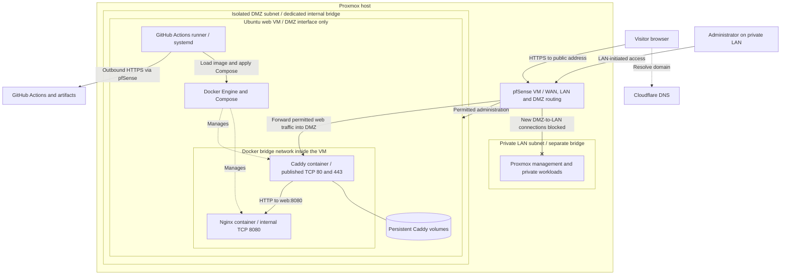
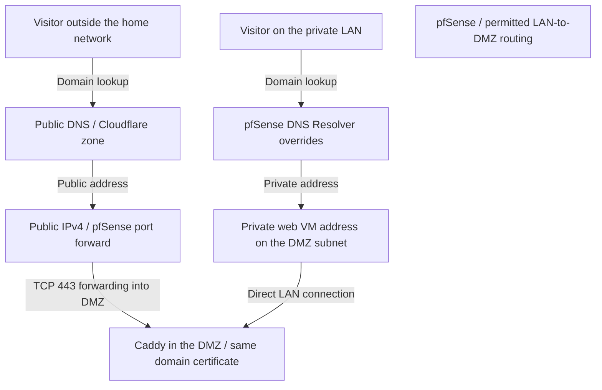
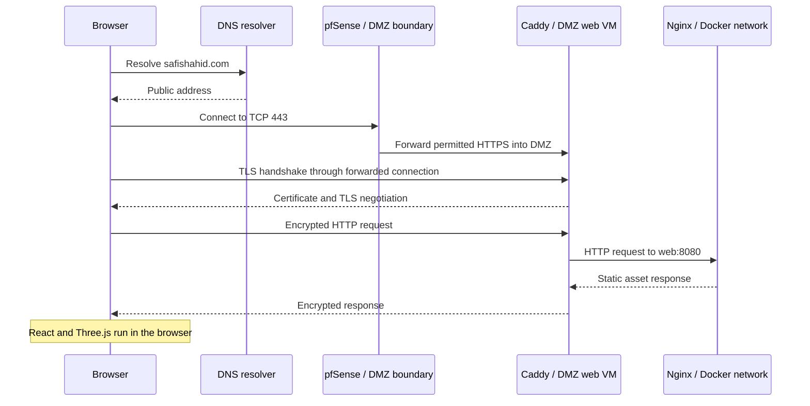
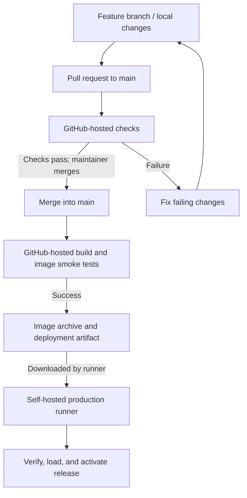
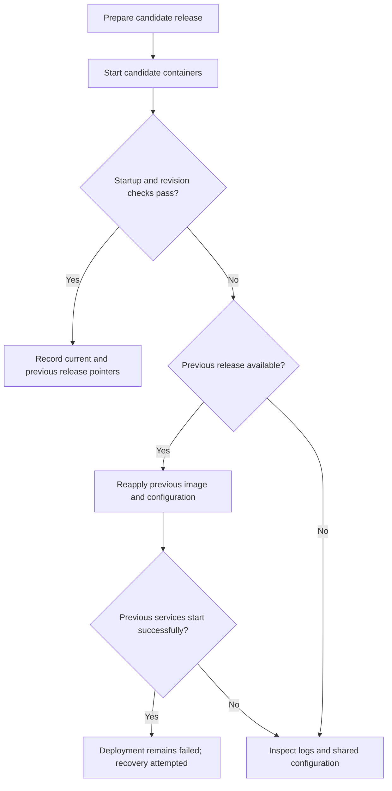

# Safi Shahid — Portfolio Architecture

**A React and Three.js portfolio hosted on an Ubuntu VM in my Proxmox home lab.**

[Visit the portfolio](https://safishahid.com) · [LinkedIn](https://www.linkedin.com/in/safi-shahid/) · [GitHub profile](https://github.com/SafiShahid34)

This project brings together GitHub Actions CI/CD, Docker, Linux administration, network routing, DNS, and automated HTTPS. GitHub builds the application, and a self-hosted runner deploys it to the VM.

This repository provides an architecture breakdown. Application source code, deployment configuration, and administrative procedures are maintained separately in a private repository.

## Contents

- [Project at a glance](#project-at-a-glance)
- [Architecture](#architecture)
- [DMZ isolation and network security](#dmz-isolation-and-network-security)
- [Docker and container runtime](#docker-and-container-runtime)
- [Application and rendering](#application-and-rendering)
- [Compute and resource usage](#compute-and-resource-usage)
- [Containers and runtime](#containers-and-runtime)
- [Networking and firewall controls](#networking-and-firewall-controls)
- [Domain and DNS](#domain-and-dns)
- [HTTPS and request flow](#https-and-request-flow)
- [CI/CD and release delivery](#cicd-and-release-delivery)
- [Health checks and recovery](#health-checks-and-recovery)
- [Runner trust and security boundaries](#runner-trust-and-security-boundaries)
- [Monitoring and observability — planned](#monitoring-and-observability--planned)
- [Architectural decisions](#architectural-decisions)
- [Source organization](#source-organization)
- [Technical references](#technical-references)

## Project at a glance

| Area | Implementation |
| --- | --- |
| Application | React, TypeScript, Vite, Three.js, React Three Fiber |
| Presentation | Tailwind CSS, project CSS, GSAP, Drei, selective postprocessing |
| Hosting | Ubuntu Server 24.04 LTS on Proxmox VE |
| VM resources | **1 vCPU and 4 GB RAM** |
| Containers | Docker and Docker Compose |
| Static web server | Nginx |
| Reverse proxy and HTTPS | Caddy with automated certificate management |
| CI | GitHub-hosted build and validation jobs |
| Deployment | Self-hosted GitHub Actions runner managed by systemd |
| Domain and DNS | Cloudflare, using DNS-only records |
| Network controls | pfSense perimeter rules and UFW host policy |
| Monitoring — planned | Prometheus metrics, Grafana dashboards, exporters, and Alertmanager |
| Release management | Commit-tagged images, verified artifacts, retained releases, and scripted rollback |

Resource measurements below are snapshots from the deployment, not load-test results.

## Architecture

### Production topology

The architecture has two main paths:

- **Website traffic:** the browser resolves the domain, connects through pfSense, and receives the site through Caddy and Nginx.
- **Deployment traffic:** the runner connects outward to GitHub, downloads a build artifact, and uses Docker to activate the release.

Ubuntu runs Docker and the deployment runner as host services. Caddy and Nginx run as separate containers sharing the VM's kernel. The runner handles deployments; it does not serve visitor requests.

### Where work happens

| Location | Responsibility |
| --- | --- |
| Development laptop | Content and code changes, local previews, Git branches |
| GitHub-hosted runner | Dependency installation, validation, application and image builds, smoke tests |
| Production VM | Artifact verification, image loading, deployment, and release checks |
| Caddy container | HTTPS, redirects, reverse proxying, and compression |
| Nginx container | Static files and application health/revision responses |
| Visitor's browser | React execution, WebGL rendering, and interaction |

Building on GitHub keeps compilation off the small production VM. Three.js rendering uses the visitor's graphics hardware; the server delivers the assets.

## Application and rendering

The site includes the main portfolio and a dedicated consulting page. It presents skills, experience, projects, contact information, services, and a downloadable resume. Typed content files keep routine updates separate from the interface components.

WebGL scenes load on demand, offscreen scenes unmount, and smaller screens use reduced rendering detail. Reduced-motion preferences, fallbacks, semantic HTML, keyboard navigation, and visible focus states support usability.

The application is a static, client-rendered React site with no application backend or database.

## Compute and resource usage

The Ubuntu VM has **1 vCPU and 4 GB of RAM**.

| Component | Allocation or limit | Recorded memory use |
| --- | --- | --- |
| Ubuntu VM | 1 vCPU, 4 GB RAM | 685 MiB used; 3.2 GiB available |
| Caddy | 0.50 CPU, 256 MiB memory | Approximately 9.3 MiB |
| Nginx | 0.50 CPU, 256 MiB memory | Approximately 2.6 MiB |
| Runner service | Shares host resources | Approximately 39.5 MiB in a separate sample |

Both containers reported negligible CPU use in the idle sample. Container limits are ceilings, not reserved CPU cores or preallocated memory. The operating system, Docker, and the runner also consume resources.

The observed footprint suits this small static site. It does not establish a maximum visitor count or peak-load capacity; deployments, retained images, and future services can increase resource use.

## Containers and runtime

### Nginx application container

The image contains the compiled frontend and a release identifier. Nginx serves these files without a Node.js application server or development server.

The web container runs as a non-root user with a read-only root filesystem, limited temporary writable storage, dropped Linux capabilities, and privilege escalation disabled. CPU, memory, and process limits constrain resource consumption.

I moved the website from the private LAN to a **dedicated DMZ: a separate subnet for the public workload**. The goal is to keep a compromised web VM from initiating unrestricted connections to private devices or management services.

Caddy is the public entry point. It handles HTTPS and forwards requests to Nginx over the Docker network. Nginx has no direct published host port.

Persistent volumes preserve Caddy's certificate and runtime state across container replacement, and its configuration is mounted read-only. Caddy also has resource and log limits; the Nginx-specific hardening settings do not all apply to Caddy.

### Restarts, logs, and caching

Both services have restart policies and bounded Docker log rotation. Health status and restart behavior are separate: an unhealthy result alone does not automatically restart a container.

Content-hashed frontend assets use long-lived caching, while the HTML and resume require revalidation. Release-identification responses are not cached. Runtime logs support diagnosis and routine maintenance.

## Networking and firewall controls

pfSense controls traffic entering the home network. Port forwarding and associated firewall rules direct public HTTP and HTTPS requests to Caddy. Administrative services are not intentionally exposed through those forwards.

UFW provides a default-deny inbound host policy, permits outbound connectivity, and limits SSH administration to the local administration network. The runner initiates outbound connections to GitHub, so deployments do not require inbound SSH from GitHub.

Docker-published traffic can follow Docker's own firewall and NAT rules before ordinary UFW filtering. The design therefore relies on both the narrow container port exposure and perimeter policy, rather than treating UFW as the sole boundary. [Docker firewall behavior](https://docs.docker.com/engine/network/packet-filtering-firewalls/)

Private addresses, administration subnets, rule definitions, and configuration commands are omitted from this public breakdown.

## Domain and DNS

Cloudflare provides domain registration and authoritative DNS. The apex domain points to the public connection, and the `www` record resolves to the same site.

The records use **DNS-only mode**. Cloudflare resolves the hostname; website traffic goes directly to the home connection and Caddy. Cloudflare's HTTP proxy, caching, and edge TLS services are not part of this path.

### Split DNS

Local clients use the internal resolver to reach the web VM directly, while external visitors use the public address. Both paths use the same domain names and HTTPS certificates.

Split DNS supports access from the home network without depending on NAT reflection. DNS selects the destination address; it does not relay website traffic.

## HTTPS and request flow

Caddy obtains and renews publicly trusted certificates for the configured hostnames and redirects HTTP traffic to HTTPS. Persistent certificate storage preserves this state during deployments, so a separate certificate container is unnecessary.

### Request sequence

pfSense forwards the connection, and Caddy terminates TLS. The upstream connection to Nginx uses HTTP within the Docker network. Certificates validate the hostname, allowing the same domain to work through both public and internal DNS.

## CI/CD and release delivery

### Repository workflow

Changes are made on feature branches and submitted through pull requests into `main`. GitHub-hosted jobs perform validation and build the deployable image. Merging into `main` triggers the release workflow; manual deployment is also supported.

The workflow automates checks and deployment. Pull-request merging remains a maintainer action.

### Build and validation

Pull-request checks install the locked dependencies, check formatting and TypeScript, and compile the frontend.

The release build then:

1. Packages the compiled application into an image tagged with its Git commit.
2. Starts a temporary container for smoke tests.
3. Checks service health, expected homepage content, the release revision, and resume-file consistency.
4. Exports the tested image and generates a SHA-256 checksum.
5. Publishes the image archive and deployment files as a GitHub Actions artifact.

These checks validate the build and key responses. They are not a comprehensive browser, accessibility, or security test suite.

### Production deployment

A dedicated systemd-managed runner downloads the successful build artifact. The VM receives the tested image instead of compiling the application itself.

| Stage | Purpose |
| --- | --- |
| Validate | Confirm the requested release and required configuration |
| Coordinate | Prevent overlapping deployment and recovery operations |
| Verify | Check the image archive against its checksum |
| Load | Import the image into Docker |
| Prepare | Retain the release configuration and validate it |
| Activate | Replace the running containers and wait for startup checks |
| Confirm | Compare the application revision with the requested release |
| Record | Update the current and previous release references |

Workflow concurrency controls and a host-side lock coordinate changes. Production deployment is restricted to the main-branch workflow, while pull-request checks use GitHub-hosted runners.

### Release storage

The VM retains release-specific configuration, references to the current and previous successful releases, and Docker images needed for rollback. Production environment settings are maintained separately from the application source.

The application itself lives in the Docker image. GitHub artifacts provide the transfer mechanism; this deployment does not require a separately operated container registry.

## Health checks and recovery

### What is checked

| Check | Purpose |
| --- | --- |
| Formatting, type checks, and build | Verify that the source passes the configured build requirements |
| Service health | Confirm that the web service responds |
| Homepage and resume checks | Validate expected HTML content and consistency of the served resume file |
| Release revision | Confirm that the requested image is serving the application |
| External HTTPS verification | Check the public DNS, routing, certificate, and response path |

Internal health and revision checks do not prove public HTTPS availability. External verification is a separate check, and continuous external monitoring is not claimed as part of the current pipeline.

### Recovery flow

When activation fails, the deployment process attempts to restore a retained previous release. Manual rollback is also supported when the required image and configuration remain available.

Recovery is best effort. Releases share the same host, network, persistent state, and environment configuration, so restoring an older image cannot resolve every infrastructure failure. Recovery should be followed by release and HTTPS verification.

This is an in-place deployment, so brief interruptions are possible during container replacement.

## Runner trust and security boundaries

The dedicated deployment account separates automation from interactive administration. Its Docker access remains highly privileged and must be treated as production access.

The VM trusts deployment files produced by the private build workflow. Repository and workflow permissions therefore matter as much as host access. Public documentation changes have no deployment authority, and public pull-request code is not assigned to the production runner.

Checksums verify transfer consistency; they are not independent proof of who produced an artifact. Container restrictions, firewall controls, and HTTPS each address different risks and do not amount to a complete security assessment.

## Monitoring and observability — planned

The next phase will add Prometheus-based monitoring for the VM, containers, and website. The proposed supporting tools will provide dashboards and alerts alongside the existing deployment checks.

| Tool | Planned role |
| --- | --- |
| Prometheus | Collect and retain time-series metrics and evaluate alert rules |
| Node Exporter | Expose Linux CPU, memory, filesystem, and network metrics |
| cAdvisor | Provide container CPU, memory, and network usage metrics |
| Grafana | Display infrastructure and application-availability dashboards |
| Blackbox Exporter | Probe HTTP/HTTPS availability, response time, and certificate expiry |
| Alertmanager | Group and route notifications generated by Prometheus alerts |

Initial alerts will focus on failed website probes, sustained resource pressure, low disk space, and approaching certificate expiry. Monitoring will be introduced incrementally, with collection frequency and retention sized to the available resources.

Dashboards and metric endpoints are intended for private administrative access. Public reachability checks will require a probe outside the home network. This monitoring integration is planned and is not included in the current resource measurements.

## Architectural decisions

| Decision | Implementation and purpose |
| --- | --- |
| Static React application | Deliver compiled assets through Nginx, with interface logic running in the browser |
| Typed content files | Keep profile, experience, projects, and consulting content separate from presentation |
| Separate page routes | Provide a dedicated consulting page while retaining the main portfolio experience |
| On-demand WebGL | Load visual scenes when needed and manage rendering according to viewport visibility |
| GitHub-hosted builds | Run validation, compile the application, and test its image before deployment |
| Artifact-based delivery | Transfer the tested image to production with a checksum and commit identifier |
| Caddy and Nginx | Separate HTTPS and reverse-proxy responsibilities from static-file delivery |
| Self-hosted deployment runner | Automate local Docker releases through outbound communication with GitHub |
| Ubuntu VM on Proxmox | Host the application in a dedicated, resource-limited virtual machine |
| Split DNS | Support the same domain names from both the home network and external networks |
| Retained releases | Keep the image and configuration needed to restore a previous deployment |

Routine operations include system and image updates, log review, resource tracking, release retention, and preservation of certificate state. Planned improvements include the monitoring integration above, backup and restore validation, automated DNS updates where needed, and performance and accessibility measurements.

## Source organization

The application separates content, pages, reusable components, and 3D rendering. The main portfolio and consulting page share the same application shell and visual system.

### Source map

| Source area | Responsibility |
| --- | --- |
| `src/data/profile.ts` | Bio, contact details, education, certification, and navigation |
| `src/data/skills.ts` | Skill groups and descriptions |
| `src/data/experience.ts` | Role dates, titles, summaries, and achievements |
| `src/data/projects.ts` | Configuration for the three project cards, including publication status and previews |
| `src/data/consulting.ts` | Consulting services, project process, and pricing content |
| `src/pages/` | Main portfolio page and dedicated `/consulting` page |
| `src/sections/` | Portfolio sections and consulting-page sections |
| `src/three/Scene.tsx` | Lazy loading, viewport-based scene activation, and error handling |
| `src/three/SceneCanvas.tsx` | Deterministic geometry, interaction, and optional bloom |
| `src/components/` | Shared navigation, headings, boot sequence, command interface, and email-copy control |
| `src/lib/router.tsx` | Lightweight History API routing and internal links |
| `src/lib/usePageMeta.ts` | Per-route title, description, and canonical URL |
| `src/lib/resumeAssistant.ts` | Command handling and an extension point for future question answering |
| `src/App.tsx` | Shared application shell, routes, and keyboard shortcuts |
| `src/main.tsx` | React entry point |
| `src/styles.css` | Responsive layout, typography, and reduced-motion styles |
| `scripts/export-resume-data.mjs` | Export structured resume facts for PDF generation |
| `scripts/generate-resume.py` | Generate the downloadable resume using ReportLab |
| `public/` | Resume PDF, Open Graph preview, and other static assets |

### Code organization

**Content and presentation:** Typed data files hold the content, while React components handle its presentation. Routine wording changes generally stay within the data layer. Project records determine whether cards display live content or a coming-soon state.

**Pages and navigation:** Separate page components compose the portfolio and consulting experiences. Shared navigation, routing, and page metadata keep behavior consistent across both.

**Rendering:** Scene loading and error handling are separated from geometry and interaction. Viewport gating and optional effects manage WebGL work while keeping readable content independent of the visual layer.

**Resume generation:** The PDF-generation scripts reuse structured facts to help keep the downloadable resume aligned with the website.

## Technical references

- [Prometheus: monitoring overview](https://prometheus.io/docs/introduction/overview/)
- [Prometheus: Node Exporter](https://prometheus.io/docs/guides/node-exporter/)
- [cAdvisor: container metrics](https://github.com/google/cadvisor)
- [Grafana: Prometheus integration](https://grafana.com/docs/grafana/latest/datasources/prometheus/)
- [Blackbox Exporter](https://github.com/prometheus/blackbox_exporter)
- [Alertmanager](https://prometheus.io/docs/alerting/latest/alertmanager/)
- [Caddy: automatic HTTPS](https://caddyserver.com/docs/automatic-https)
- [Caddy: reverse proxy](https://caddyserver.com/docs/caddyfile/directives/reverse_proxy)
- [Docker: firewall behavior](https://docs.docker.com/engine/network/packet-filtering-firewalls/)
- [Docker: Linux installation and Docker group privileges](https://docs.docker.com/engine/install/linux-postinstall/)
- [GitHub: self-hosted runners](https://docs.github.com/en/actions/concepts/runners/self-hosted-runners)
- [GitHub: secure use of Actions](https://docs.github.com/en/actions/reference/security/secure-use)
- [Cloudflare: DNS proxy status](https://developers.cloudflare.com/dns/proxy-status/)
- [pfSense: split DNS](https://docs.netgate.com/pfsense/en/latest/nat/reflection.html#split-dns)

Maintained by [Safi Shahid](https://github.com/SafiShahid34).
